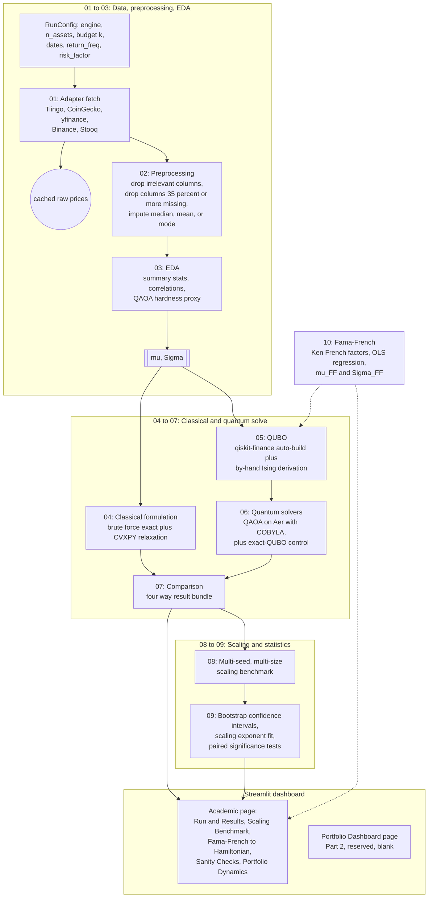

# QAOA for Constrained Portfolio Optimization

An academic engine that reformulates the cardinality-constrained Markowitz portfolio
problem as a QUBO, solves it with the Quantum Approximate Optimization Algorithm (QAOA),
and benchmarks the result against classical solvers, on real crypto and equity market
data. Built as Part 1 (academic) of a two-part project; Part 2 (a portfolio-management
dashboard extension) is a reserved, currently-blank page in the same app.

This document is the project's single reference: why it exists, what data it uses, how
to run it, how it is organized, what was assumed, and what the results actually show
(including where the classical baseline wins, stated honestly rather than glossed over).

---

## 1. Why this project

Selecting the best k assets out of n, under a mean-variance objective, is a combinatorial
problem: choosing exactly k assets out of n is a search over C(n, k) subsets, which grows
too fast to brute-force once n gets large. Classical mean-variance optimization (Markowitz)
handles the *continuous* weighting problem efficiently, but the *cardinality constraint*
("pick exactly k assets, not a little bit of all of them") is what turns this from a
polynomial-time quadratic program into an NP-hard combinatorial search.

QAOA is a hybrid quantum-classical algorithm built for exactly this shape of problem: a
combinatorial objective that can be written as a QUBO (Quadratic Unconstrained Binary
Optimization) and mapped onto qubits. The goal of this project is not to claim a "quantum
speedup" (at the qubit counts a laptop simulator can run, there isn't one, and the results
below say so plainly) but to build the full, correct pipeline end to end: formulate the
classical problem, translate it into a QUBO and an Ising Hamiltonian by hand as well as via
a library, solve it both classically and with QAOA, and report an honest, statistically
grounded comparison of where each approach stands as the problem scales.

## 2. About the data

Two parallel data engines exist behind one shared solver core: **crypto** and **equity**.
The solver core never sees a raw price or a data source; it only ever consumes an expected
return vector (mu) and a covariance matrix (Sigma), both derived from a single clean price
series per asset.

| | Crypto engine | Equity engine |
|---|---|---|
| Universe | Top-N coins by market cap (CoinGecko) | Static diversified large-cap list (override with your own tickers) |
| Price source (in order tried) | Tiingo (if `TIINGO_API_KEY` set) -> CoinGecko -> Binance public klines | Tiingo (if key set) -> yfinance -> Stooq |
| Price used | Daily close, USD | Adjusted close (splits/dividends folded in) |
| Calendar | 365 days/year (crypto trades 24/7) | 252 trading days/year (exchange calendar) |
| Fundamentals/technicals | Not used | Not used |

Only a **price history per asset** is required. Fundamentals (EPS, P/E ratios) and full
OHLCV data are deliberately not fetched: the solver core only ever needs (mu, Sigma), and
data_requirements.txt (the project's data-scoping note) is explicit that fundamentals only
matter for an optional future pre-filter/screening layer, not for the QAOA/QUBO core
itself. The user-selectable "holding period" (daily, weekly, or monthly returns) is a
`RunConfig.return_freq` parameter, not something the algorithm decides on its own.

**Live-fetch reality, found while building this:** CoinGecko's free tier now returns 401
Unauthorized on its historical `market_chart/range` endpoint without a paid Demo key
(discovered during development, not documented anywhere obviously public at time of
writing), and `api.binance.com` returns 451 (geo-blocked) from a US IP. The crypto adapter
therefore falls through Tiingo, then CoinGecko, then `api.binance.com`, then
`api.binance.us`, and the pipeline uses whichever succeeds. Every fetch is cached to
`data_cache/` so a later offline run still works.

**Tiingo:** the project instructions mention a Tiingo API key is available. The code is
already wired to use it as the first-choice source for both engines the moment it is set
as an environment variable:

```bash
# Windows PowerShell
$env:TIINGO_API_KEY = "your-key-here"
```

No key is hardcoded anywhere in this repository, per the project's own instruction to keep
credentials in the environment, and none was required to build or validate this project
(every result in this README ran on the free, keyless fallback sources).

## 3. Instructions

```bash
cd qaoa_academic_engine
pip install -r requirements.txt

# Run the interactive dashboard (both pages)
streamlit run dashboard/app.py

# Or run one pipeline pass from the command line
python engine/pipeline.py --engine equity --n-assets 8 --start 2023-01-01 --end 2024-01-01

# Run the multi-seed scaling benchmark that backs the dashboard's "Scaling
# Benchmark" tab (takes a few minutes for --preset quick, much longer for --preset full)
python scripts/run_benchmark.py --preset quick

# Regenerate the static comparison plots in this README from that benchmark
python scripts/make_readme_plots.py

# Run the sanity-check suite (also runnable live from the dashboard)
python tests/sanity_checks.py
```

Everything above runs on a noiseless local Aer simulator; no quantum hardware account is
required to reproduce any result in this README. `qrisp` is included in `requirements.txt`
as an optional path toward IQM hardware (per the project's access to IQM tokens), since
submitting to real hardware only requires swapping the sampler in `engine/06_quantum_solvers/qaoa_solver.py`;
that swap is flagged in the assumptions section below rather than implemented, since no
hardware token was available in the environment this project was built in.

## 4. Architecture

### Workflow diagram

The diagram below is the whole project end to end: one config in, four solvers compared,
statistics fitted across many runs, and everything surfaced on the dashboard. It renders
directly on GitHub; open this file there (or in any Mermaid-aware viewer) to see it as a
diagram rather than source text.



### Repository layout

```
qaoa_academic_engine/
  engine/
    01_data/                crypto + equity adapters, shared return/cleaning math
    02_preprocessing/       generic missing-data / column checklist
    03_eda/                 descriptive stats + a QAOA-hardness proxy
    04_classical_formulation/  brute force (exact) + CVXPY relaxation
    05_qubo/                QUBO via qiskit-finance, and a by-hand Ising derivation
    06_quantum_solvers/     QAOA solver + exact-QUBO diagonalization control
    07_classical_benchmark/ packages one instance's 4-way comparison
    08_benchmarking/        multi-seed, multi-size scaling sweep
    09_statistics/          bootstrap CIs, scaling-exponent fits, significance tests
    10_fama_french/         Fama-French factor model -> the same Ising Hamiltonian
    pipeline.py             orchestrates 01 -> 09 for one real-data run
  dashboard/
    app.py                  page router (Academic / Portfolio Dashboard)
    academic_page.py        Part 1: five tabs, all live/interactive
    portfolio_page.py       Part 2: reserved, intentionally blank
  scripts/
    run_benchmark.py        CLI for the stage 08/09 scaling study
    make_readme_plots.py    regenerates the PNGs embedded below
  tests/
    sanity_checks.py        targeted correctness/regression checks
  results/                  benchmark JSON + plots (tracked, not disposable)
  data_cache/                cached raw price data (not tracked; regenerated on fetch)
```

**Folder numbering.** Directories under `engine/` are numbered 01 through 10 so the file
listing itself shows the project's data flow, per the project's own naming convention. A
directory name starting with a digit is not a legal Python package name for a plain
`import` statement, so these are not Python packages; `engine/_bootstrap.py` adds each one
to `sys.path` once, and every stage file inside is then imported by its own plain name
(`from qubo_builder import build_qubo`), the same flat style the original pilot code
(`qaoa_v1`) already used. This trade-off (numbered folders for readability, flat imports
for correctness) is recorded here rather than left implicit.

**How crypto and equity data are handled: the same flow, one substitution point.** Both
engines run through the *identical* stage 01 to stage 09 pipeline. The only place they
differ is which `AssetUniverseAdapter` subclass stage 01 instantiates
(`CryptoAdapter` vs. `EquityAdapter`), which changes exactly three things: where prices
come from, whether the calendar is 365 or 252 days/year, and the default symbol universe.
Everything downstream (preprocessing, EDA, the classical solver, the QUBO builder, QAOA,
the statistics) is asset-class-agnostic and operates purely on the resulting (mu, Sigma)
pair. This is why the dashboard's engine selector is a single dropdown rather than two
separate code paths: the "Run & Results" tab literally calls the same `pipeline.run()`
function regardless of which engine is chosen.

## 5. Models used

- **Classical formulation (stage 04):** cardinality-constrained mean-variance,
  `maximize mu^T x - q * x^T Sigma x` subject to `sum(x) = k`, `x in {0,1}^n`. Solved two
  ways: exact brute force over all C(n, k) subsets (the ground truth used everywhere
  else), and a continuous-relaxation-and-round baseline via CVXPY (fast but not
  guaranteed optimal, which is exactly the point of testing it).
- **QUBO (stage 05):** the equality constraint folded into a quadratic penalty term,
  built two independent ways that are cross-checked against each other in
  `tests/sanity_checks.py`: automatically via `qiskit-finance`'s `PortfolioOptimization`
  class, and by hand (the actual algebra is in `engine/05_qubo/manual_ising.py`), including
  a from-scratch penalty-strength search and a global Hamiltonian rescaling factor
  motivated by (but not a literal reproduction of) Brandhofer et al. (2023).
- **QAOA (stage 06):** `qiskit_algorithms.QAOA` on Aer's noiseless statevector sampler,
  standard transverse-field mixer, COBYLA classical optimizer, a linear-ramp initial
  parameter point motivated by the adiabatic interpretation of QAOA. A control solver
  (exact diagonalization of the same penalized QUBO, no variational loop) runs alongside
  every QAOA solve specifically to separate "the QUBO formulation is wrong" from "the
  classical optimizer loop didn't converge" when QAOA underperforms.
- **Fama-French three-factor model (stage 10):** real daily Mkt-RF/SMB/HML factor data
  from the Ken French Data Library, OLS-regressed per asset, producing a factor-implied
  (mu, Sigma) that feeds into the exact same QUBO/Ising machinery as the plain
  sample-covariance path.
- **Statistics (stage 09):** percentile bootstrap confidence intervals (10,000
  resamples), an OLS log-linear fit for the wall-clock scaling exponent (with standard
  error, R-squared, and p-value), and a paired Wilcoxon signed-rank test (falling back to
  a paired t-test if degenerate) between QAOA and the exact-QUBO control.

## 6. Assumptions

Stated explicitly, since an assumption left implicit is the easiest thing for a reader to
get wrong:

1. **Simulator, not hardware.** All QAOA runs use Aer's noiseless statevector simulator.
   No noise model, no real quantum backend, no shot-noise-only sampling. IQM hardware
   access exists for this project but was not exercised; `qrisp` is included as the
   intended path for that extension.
2. **Selection, not weighting.** The optimizer chooses *which* k assets to hold, all with
   equal weight in this project; it does not solve for continuous portfolio weights. The
   "Portfolio Dynamics" dashboard tab is explicitly labeled illustrative for this reason.
3. **No transaction costs, no rebalancing, no slippage** anywhere in the pipeline or the
   dynamics plot.
4. **Adjusted close / plain close only.** No intraday data, no bid-ask spread, no
   dividends handled outside of yfinance's `auto_adjust`.
5. **Small n by construction.** Statevector simulation of a QAOA circuit is exponential in
   qubit count on its own; this project's benchmarking stays at n <= 14, which is a
   simulator-cost ceiling, not a claim about where quantum hardware would top out.
6. **Exact penalty search is small-n only.** `find_minimal_penalty` in stage 05 enumerates
   all 2^n bitstrings, which is only tractable up to n = 18 (configurable); above that it
   falls back to a documented heuristic scaling.
7. **k is never hardcoded.** Every stage takes n and k as parameters (`RunConfig.budget`,
   `RunConfig.n_assets`); this is enforced by a regression check in
   `tests/sanity_checks.py`, not just a coding convention.
8. **The classical bar past brute force is a real MIQP solver, not brute force forever.**
   REPORT.md from the earlier pilot version of this project (`qaoa_v1`) already flagged
   that a commercial mixed-integer solver (Gurobi/CPLEX-class, branch-and-bound) would
   beat naive brute force well past n = 30; this project's relaxation-and-round baseline
   is a free-tool stand-in for that bar, not a replacement for it, and the README says so
   rather than implying brute force is the best classical method available.
9. **Fama-French synthetic fallback is clearly labeled, never silent.** If the live fetch
   to the Ken French Data Library fails, a synthetic factor series with realistic
   volatility is used instead, and the UI/report explicitly says "SYNTHETIC placeholder"
   when that happens.

## 7. Necessary results

**Single-run example (equity, live yfinance data, n = 8, k = 4, q = 0.5, reps = 2):**
universe `AAPL, AMZN, GOOGL, JPM, META, MSFT, NVDA, TSLA`. All four solvers (brute force,
CVXPY relaxation-and-round, exact-QUBO diagonalization, QAOA) agreed on an objective value
of **2.9009**, QAOA returned a feasible solution, and its approximation ratio against the
brute-force optimum was **1.0000**, in 23.9 seconds of wall-clock time on a laptop CPU.

**Single-run example (crypto, live Binance data, n = 3 kept of 4 requested, k = 1):**
universe `bitcoin, ethereum, binancecoin` (`tether` was requested by market-cap ranking but
has no natural USD trading pair on Binance and was correctly dropped rather than
silently mis-priced at 1.0). All four solvers agreed on **0.6585**, QAOA feasible,
approximation ratio **1.0000**, in 44.9 seconds.

**Scaling benchmark** (`scripts/run_benchmark.py --preset standard`: n in {6, 8, 10, 12},
5 random synthetic instances per size, q = 0.5, reps = 2):

| n (qubits) | QAOA feasible rate | QAOA approx. ratio (feasible seeds) | Exact-QUBO approx. ratio | Mean QAOA time (s) | Mean brute-force time (s) |
|---|---|---|---|---|---|
| 6  | 4/5 (80%)  | 1.0000 | 1.0000 | 19.5 | 0.0005 |
| 8  | 5/5 (100%) | 1.0000 | 1.0000 | 13.0 | 0.0013 |
| 10 | 5/5 (100%) | 1.0000 | 1.0000 | 18.7 | 0.0056 |
| 12 | 1/5 (20%)  | 0.8501 | 1.0000 | 20.6 | 0.0239 |

The exact-QUBO control hits the true optimum at every size, every seed: the QUBO
*formulation* is correct throughout. QAOA's feasibility rate collapses at n = 12 while
still consuming the same wall-clock budget, meaning COBYLA's fixed 250-iteration budget
stopped converging as the parameter landscape grew, not that the problem became
unsolvable. This reproduces, and now statistically confirms across multiple random
instances, the exact failure mode the earlier pilot study (`qaoa_v1/REPORT.md`) first
found anecdotally at a single seed.

The benchmark was re-run in full (`scripts/run_benchmark.py --preset standard` a second
time) to check reproducibility before this README was finalized: every feasibility rate
and approximation ratio above came back byte-for-byte identical to the first run, since
each (size, trial) pair is seeded deterministically end to end. Only wall-clock times
shifted slightly (a few seconds either way), which is expected and reported honestly
below - it reflects machine load during that particular run, not any non-determinism in
the solvers themselves.

**Fitted wall-clock scaling exponents** (`log2(time) = intercept + slope * n`):

| Method | slope | slope std. error | R-squared | p-value |
|---|---|---|---|---|
| QAOA | 0.038 | 0.079 | 0.10 | 0.68 (not significant) |
| Brute force | 0.945 | 0.068 | 0.99 | 0.0051 (significant) |

A two-sample test on the difference between these two slopes gives t = -8.72,
p = 0.00095: brute force's runtime is growing measurably with n in this range and QAOA's
is not, because in this small-n, noiseless-simulator regime QAOA's cost is dominated by a
*fixed* classical-optimizer iteration budget, not by circuit size. **Read this
correctly:** brute force is still far cheaper in absolute terms at every size tested here
(milliseconds vs. tens of seconds) - the significant result is about the *slope*, not
about which method is faster today. Pushed out to n = 22 on its own (see the plot below),
brute force alone already takes about 19 seconds; where the two lines would actually
cross, if ever, on real hardware rather than a laptop simulator, is exactly the open
question this kind of benchmark exists to characterize, not something this project claims
to answer.

**Fama-French to Hamiltonian:** verified end to end against live Ken French factor data
(`engine/10_fama_french/fama_french_hamiltonian.py`, exercised interactively from the
dashboard's "Fama-French -> Hamiltonian" tab): the OLS factor fit, the
`Sigma = B F B^T + D` covariance decomposition, and the resulting Ising Hamiltonian's
ground state were all confirmed to produce a valid, feasible QUBO instance on real asset
return data.

## 8. Plots


*Left: approximation ratio vs. problem size (line, with 95% bootstrap confidence
intervals) overlaid on QAOA's feasibility rate (bars). Right: mean wall-clock time vs.
problem size for QAOA and brute force, log scale, from the same benchmark run.*


*Brute-force cost alone, pushed past the sizes QAOA was benchmarked at, to show the
combinatorial explosion this whole project exists to test an alternative against.*

Both PNGs are regenerated from `results/scaling_results.json` and
`results/scaling_summary.json` by `scripts/make_readme_plots.py`; the interactive,
larger-canvas versions (plus the correlation heatmap, the Fama-French Hamiltonian
heatmap, and the portfolio-dynamics chart) are in the Streamlit dashboard.

## 9. What is intentionally not built yet

- **Portfolio Dashboard page (Part 2):** a reserved, blank page in the app, per the
  project instructions, to be built out in a future phase.
- **Hard-constraint XY-mixers** (Dicke-state ring / full / QAMPA variants, per Brandhofer
  et al. 2023): documented as a benchmarked design space on the academic page, not
  implemented, since they require a separate Dicke-state preparation circuit and the
  project's own benchmarking claims are scoped to what actually ran.
- **HUBO (higher-order, skewness/kurtosis) formulation** (per Uotila et al. 2025):
  referenced as a natural extension, not implemented, since the reference paper's own
  results show QAOA performing *worse* on the HUBO version than on classical baselines,
  and adding it would not currently strengthen this project's findings.
- **Real quantum hardware submission (IQM/Qrisp):** the sampler is swappable in
  `engine/06_quantum_solvers/qaoa_solver.py`; not exercised in this repository since no
  hardware token was available while building it.

## 10. Glossary

**Approximation ratio** - a solution's objective value divided by the true optimum's
value (or a normalized 0-1 version); 1.0 means optimal.

**Bootstrap confidence interval** - a confidence interval built by resampling the observed
data with replacement many times (10,000 times in this project) rather than assuming a
particular statistical distribution.

**Brute force** - exhaustively checking every possible C(n, k) subset to find the true
optimum; exact but exponential in cost.

**Cardinality constraint** - a restriction that exactly k of n binary choices must be
"on"; the source of this problem's combinatorial hardness.

**COBYLA** - Constrained Optimization BY Linear Approximation, the classical, gradient-free
optimizer used to tune QAOA's variational parameters in this project.

**Feasible / infeasible** - a candidate solution is feasible if it satisfies the
cardinality constraint (selects exactly k assets); infeasible otherwise.

**Hamiltonian** - in this context, the mathematical operator whose ground state encodes
the optimal solution to the combinatorial problem; QAOA's circuit is built from it.

**Ising model** - a formulation using +1/-1 spin variables (as opposed to a QUBO's 0/1
binary variables); the two are related by a simple linear substitution.

**Markowitz / mean-variance optimization** - the classical portfolio theory framework that
trades off expected return against variance (risk).

**Mixer (in QAOA)** - the part of the QAOA circuit responsible for moving probability mass
between candidate solutions between cost-function applications; this project uses the
standard transverse-field (X-gate) mixer.

**Mu (expected return vector)** and **Sigma (covariance matrix)** - the two statistical
inputs the entire solver core is built around, regardless of asset class or data source.

**Penalty term** - a quadratic term added to an objective to punish constraint
violations, turning a constrained problem into an unconstrained one (a QUBO).

**QAOA** - Quantum Approximate Optimization Algorithm; a hybrid quantum-classical
algorithm for combinatorial optimization.

**QUBO** - Quadratic Unconstrained Binary Optimization; an objective over 0/1 variables
with no explicit constraints, the standard input format for QAOA.

**Qubit** - a quantum bit; in this project, one qubit represents one binary "is this asset
selected" decision.

**Reps / p (QAOA depth)** - the number of alternating cost/mixer layers in the QAOA
circuit; more layers generally means better solution quality at the cost of more
classical-optimizer work per circuit evaluation.

**Risk-aversion coefficient (q)** - the weight placed on portfolio variance relative to
expected return in the objective function.

**Scaling exponent** - the fitted slope of log(time) vs. problem size; used here to
characterize how a method's cost grows, independent of its absolute speed at any one size.

**Statevector simulator** - a classical simulation of a quantum circuit that tracks the
exact quantum state; exact but exponential in qubit count, unlike real quantum hardware.

## 11. References

The formulation, mixer, and statistical-methodology choices in this project were informed
by the academic literature below. None of these papers, or the project's internal notes
about them, are redistributed in this repository (no PDFs, no local copies, no scraped
excerpts) - only their published bibliographic details, which are public information,
are cited here, as is standard academic practice.

### Academic papers

1. Yalovetzky, R., Schuetz, S. J., He, Y., Shen, Y., Sun, X., Raymond, R., et al. (2026).
   *Quantum-Informed Portfolio Selection: An End-to-End Pipeline Validated on Trapped-Ion
   Hardware with Real Market Data.* arXiv:2607.01037.
2. Aggarwal, P., Agarwal, N., Shrivastava, A., & Kler, R. (2025). *Bridging Quantum
   Algorithms and Classical Finance: Portfolio Optimization Using QAOA and QUBO Framework.*
   Proceedings of the IEEE UPWIECON 2025 conference.
3. Turan, N. (2024). *Numerical Analysis of QAOA for Financial Optimization.*
4. Uotila, V., Ripatti, A., & Zhao, Z. (2025). *Higher-Order Portfolio Optimization with
   Quantum Approximate Optimization Algorithm.* Proceedings of IEEE Quantum Week (QCE) 2025.
   Reference implementation: github.com/valterUo/quantum-portfolio.
5. Brandhofer, S., Braun, D., Dehn, V., Hellstern, G., Huls, M., Ji, Y., Polian, I.,
   Bhatia, A. S., & Wellens, T. (2023). *Benchmarking the performance of portfolio
   optimization with QAOA.* Quantum Information Processing, 22(1), 25.
   https://doi.org/10.1007/s11128-022-03766-5
6. Fama, E. F., & French, K. R. (1993). *Common risk factors in the returns on stocks and
   bonds.* Journal of Financial Economics, 33(1), 3-56.
7. Farhi, E., Goldstone, J., & Gutmann, S. (2014). *A Quantum Approximate Optimization
   Algorithm.* arXiv:1411.4028. (Original QAOA paper; the alternating cost/mixer ansatz
   used throughout this project's stage 06 follows this construction.)
8. Hadfield, S., Wang, Z., O'Gorman, B., Rieffel, E. G., Venturelli, D., & Biswas, R.
   (2019). *From the Quantum Approximate Optimization Algorithm to a Quantum Alternating
   Operator Ansatz.* Algorithms, 12(2), 34. (Background for the hard-constraint XY-mixer
   design space discussed, but not implemented, on the academic dashboard page.)
9. Lucas, A. (2014). *Ising formulations of many NP problems.* Frontiers in Physics, 2, 5.
   (Background for the binary/logarithmic encoding referenced in the HUBO discussion.)
10. IQM Quantum Computers. *Quantum Summer School 2026, Day 2: Variational Quantum
    Algorithms (QAOA and MaxCut)* - internal educational course material, used only as a
    pedagogical reference for explaining QAOA's cost/mixer structure; not reproduced here.

### Data sources

- Ken French Data Library, Tuck School of Business, Dartmouth College (Fama-French factor
  returns) - https://mba.tuck.dartmouth.edu/pages/faculty/ken.french/data_library.html
- CoinGecko API (crypto market data) - https://www.coingecko.com/en/api
- Binance public market data API - https://www.binance.com and https://www.binance.us
- Tiingo (equity and crypto end-of-day data) - https://www.tiingo.com
- Yahoo Finance, via the `yfinance` library (equity price history)
- Stooq (equity price history fallback) - https://stooq.com

### Software

- Qiskit, Qiskit Aer, Qiskit Algorithms, Qiskit Optimization, and Qiskit Finance (IBM
  Quantum) - https://www.ibm.com/quantum/qiskit
- CVXPY (Diamond & Boyd, 2016, *CVXPY: A Python-Embedded Modeling Language for Convex
  Optimization*, Journal of Machine Learning Research)
- Qrisp (optional path to IQM hardware) - https://www.qrisp.eu
- NumPy, pandas, SciPy, statsmodels, Streamlit, Plotly, matplotlib
