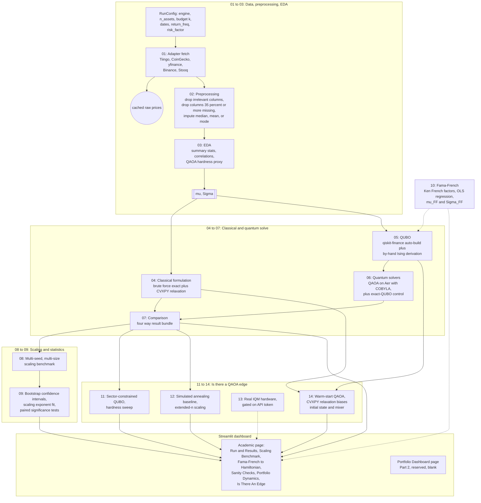
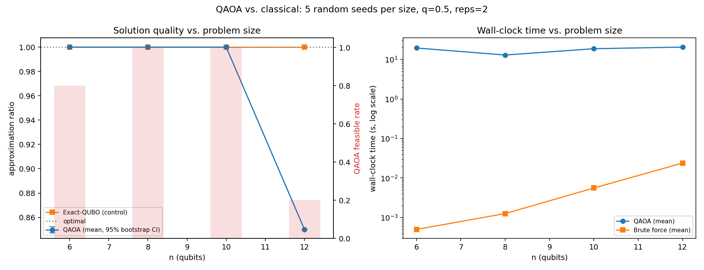
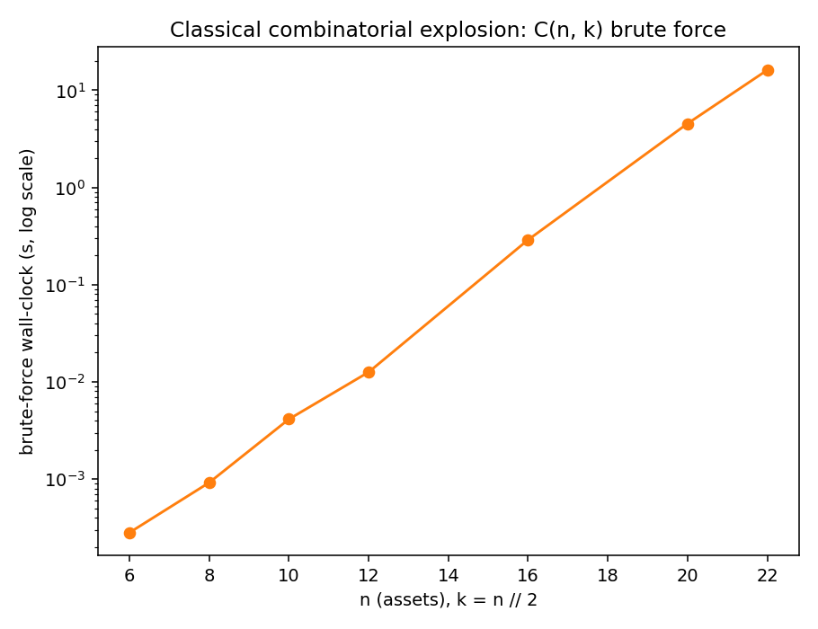

# QAOA for Constrained Portfolio Optimization (Part 1: Academic)

An academic engine that reformulates the cardinality-constrained Markowitz portfolio
problem as a QUBO, solves it with the Quantum Approximate Optimization Algorithm (QAOA),
and benchmarks the result against classical solvers, on real crypto and equity market
data. This is Part 1 (academic) of a two-part project; Part 2, the portfolio-management
dashboard that builds on top of this engine, is at [README.md](README.md) on this same
branch (or on the `portfolio-dashboard` branch specifically, if you are reading this from
`main`, which is academic-only by design - use the branch selector at the top of the
repository page to switch).

This document is Part 1's own reference: why it exists, what data it uses, how to run it,
how it is organized, what was assumed, and what the results actually show (including
where the classical baseline wins, stated honestly rather than glossed over).

---

## 1. Why this project

Selecting the best k assets out of n, under a mean-variance objective, is a combinatorial
problem: choosing exactly k assets out of n is a search over C(n, k) subsets, which grows
too fast to brute-force once n gets large. Classical mean-variance optimization (Markowitz)
handles the *continuous* weighting problem efficiently, but the *cardinality constraint*
("pick exactly k assets, not a little bit of all of them") is what turns this from a
polynomial-time quadratic program into an NP-hard combinatorial search.

QAOA is a hybrid quantum-classical algorithm built for exactly this shape of problem: a
combinatorial objective that can be written as a QUBO (Quadratic Unconstrained Binary
Optimization) and mapped onto qubits. The goal of this project is not to claim a "quantum
speedup" (at the qubit counts a laptop simulator can run, there isn't one, and the results
below say so plainly) but to build the full, correct pipeline end to end: formulate the
classical problem, translate it into a QUBO and an Ising Hamiltonian by hand as well as via
a library, solve it both classically and with QAOA, and report an honest, statistically
grounded comparison of where each approach stands as the problem scales.

## 2. About the data

Two parallel data engines exist behind one shared solver core: **crypto** and **equity**.
The solver core never sees a raw price or a data source; it only ever consumes an expected
return vector (mu) and a covariance matrix (Sigma), both derived from a single clean price
series per asset.

| | Crypto engine | Equity engine |
|---|---|---|
| Universe | Top-N coins by market cap (CoinGecko) | Static diversified large-cap list (override with your own tickers) |
| Price source (in order tried) | Tiingo (if `TIINGO_API_KEY` set) -> CoinGecko -> Binance public klines | Tiingo (if key set) -> yfinance -> Stooq |
| Price used | Daily close, USD | Adjusted close (splits/dividends folded in) |
| Calendar | 365 days/year (crypto trades 24/7) | 252 trading days/year (exchange calendar) |
| Fundamentals/technicals | Not used | Not used |

Only a **price history per asset** is required. Fundamentals (EPS, P/E ratios) and full
OHLCV data are deliberately not fetched: the solver core only ever needs (mu, Sigma), and
data_requirements.txt (the project's data-scoping note) is explicit that fundamentals only
matter for an optional future pre-filter/screening layer, not for the QAOA/QUBO core
itself. The user-selectable "holding period" (daily, weekly, or monthly returns) is a
`RunConfig.return_freq` parameter, not something the algorithm decides on its own.

**Live-fetch reality, found while building this:** CoinGecko's free tier now returns 401
Unauthorized on its historical `market_chart/range` endpoint without a paid Demo key
(discovered during development, not documented anywhere obviously public at time of
writing), and `api.binance.com` returns 451 (geo-blocked) from a US IP. The crypto adapter
therefore falls through Tiingo, then CoinGecko, then `api.binance.com`, then
`api.binance.us`, and the pipeline uses whichever succeeds. Every fetch is cached to
`data_cache/` so a later offline run still works.

**Tiingo:** the project instructions mention a Tiingo API key is available. The code is
already wired to use it as the first-choice source for both engines the moment it is set
as an environment variable:

```bash
# Windows PowerShell
$env:TIINGO_API_KEY = "your-key-here"
```

No key is hardcoded anywhere in this repository, per the project's own instruction to keep
credentials in the environment, and none was required to build or validate this project
(every result in this README ran on the free, keyless fallback sources).

## 3. Instructions

```bash
cd qaoa_academic_engine
pip install -r requirements.txt

# Run the interactive dashboard (both pages)
streamlit run dashboard/app.py

# Or run one pipeline pass from the command line
python engine/pipeline.py --engine equity --n-assets 8 --start 2023-01-01 --end 2024-01-01

# Run the multi-seed scaling benchmark that backs the dashboard's "Scaling
# Benchmark" tab (takes a few minutes for --preset quick, much longer for --preset full)
python scripts/run_benchmark.py --preset quick

# Regenerate the static comparison plots in this README from that benchmark
python scripts/make_readme_plots.py

# Run the sanity-check suite (also runnable live from the dashboard)
python tests/sanity_checks.py
```

Everything above runs on a noiseless local Aer simulator; no quantum hardware account is
required to reproduce any result in this README. `qrisp` is included in `requirements.txt`
as an optional path toward IQM hardware (per the project's access to IQM tokens), since
submitting to real hardware only requires swapping the sampler in `engine/06_quantum_solvers/qaoa_solver.py`;
that swap is flagged in the assumptions section below rather than implemented, since no
hardware token was available in the environment this project was built in.

## 4. Architecture

### Workflow diagram

The diagram below is the whole project end to end: one config in, four solvers compared,
statistics fitted across many runs, and everything surfaced on the dashboard. It renders
directly on GitHub; open this file there (or in any Mermaid-aware viewer) to see it as a
diagram rather than source text.



### Repository layout

```
qaoa_academic_engine/
  engine/
    01_data/                crypto + equity adapters, shared return/cleaning math
    02_preprocessing/       generic missing-data / column checklist
    03_eda/                 descriptive stats + a QAOA-hardness proxy
    04_classical_formulation/  brute force (exact) + CVXPY relaxation
    05_qubo/                QUBO via qiskit-finance, and a by-hand Ising derivation
    06_quantum_solvers/     QAOA solver + exact-QUBO diagonalization control
    07_classical_benchmark/ packages one instance's 4-way comparison
    08_benchmarking/        multi-seed, multi-size scaling sweep
    09_statistics/          bootstrap CIs, scaling-exponent fits, significance tests
    10_fama_french/         Fama-French factor model -> the same Ising Hamiltonian
    11_hard_constraints/    sector-cap QUBO variant + fixed-n hardness sweep
    12_classical_heuristics/  simulated annealing + extended-n scaling vs. QAOA
    13_hardware/            real IQM hardware path, gated on IQM_RESONANCE_TOKEN
    14_warm_start_qaoa/     CVXPY-relaxation-biased mixer/initial state for QAOA
    pipeline.py             orchestrates 01 -> 09 for one real-data run
  dashboard/
    app.py                  page router (Academic / Portfolio Dashboard)
    academic_page.py        Part 1: six tabs, all live/interactive
    portfolio_page.py       Part 2: reserved, intentionally blank
  scripts/
    run_benchmark.py        CLI for the stage 08/09 scaling study
    run_edge_search.py      CLI for the stage 11/12 "is there an edge" search
    run_warm_start_comparison.py  CLI for the stage 14 warm-start comparison
    make_readme_plots.py    regenerates the PNGs embedded below
  tests/
    sanity_checks.py        targeted correctness/regression checks
  results/                  benchmark JSON + plots (tracked, not disposable)
  data_cache/                cached raw price data (not tracked; regenerated on fetch)
```

**Folder numbering.** Directories under `engine/` are numbered 01 through 13 so the file
listing itself shows the project's data flow, per the project's own naming convention. A
directory name starting with a digit is not a legal Python package name for a plain
`import` statement, so these are not Python packages; `engine/_bootstrap.py` adds each one
to `sys.path` once, and every stage file inside is then imported by its own plain name
(`from qubo_builder import build_qubo`), the same flat style the original pilot code
(`qaoa_v1`) already used. This trade-off (numbered folders for readability, flat imports
for correctness) is recorded here rather than left implicit.

**How crypto and equity data are handled: the same flow, one substitution point.** Both
engines run through the *identical* stage 01 to stage 09 pipeline. The only place they
differ is which `AssetUniverseAdapter` subclass stage 01 instantiates
(`CryptoAdapter` vs. `EquityAdapter`), which changes exactly three things: where prices
come from, whether the calendar is 365 or 252 days/year, and the default symbol universe.
Everything downstream (preprocessing, EDA, the classical solver, the QUBO builder, QAOA,
the statistics) is asset-class-agnostic and operates purely on the resulting (mu, Sigma)
pair. This is why the dashboard's engine selector is a single dropdown rather than two
separate code paths: the "Run & Results" tab literally calls the same `pipeline.run()`
function regardless of which engine is chosen.

## 5. Models used

- **Classical formulation (stage 04):** cardinality-constrained mean-variance,
  `maximize mu^T x - q * x^T Sigma x` subject to `sum(x) = k`, `x in {0,1}^n`. Solved two
  ways: exact brute force over all C(n, k) subsets (the ground truth used everywhere
  else), and a continuous-relaxation-and-round baseline via CVXPY (fast but not
  guaranteed optimal, which is exactly the point of testing it).
- **QUBO (stage 05):** the equality constraint folded into a quadratic penalty term,
  built two independent ways that are cross-checked against each other in
  `tests/sanity_checks.py`: automatically via `qiskit-finance`'s `PortfolioOptimization`
  class, and by hand (the actual algebra is in `engine/05_qubo/manual_ising.py`), including
  a from-scratch penalty-strength search and a global Hamiltonian rescaling factor
  motivated by (but not a literal reproduction of) Brandhofer et al. (2023).
- **QAOA (stage 06):** `qiskit_algorithms.QAOA` on Aer's noiseless statevector sampler,
  standard transverse-field mixer, COBYLA classical optimizer, a linear-ramp initial
  parameter point motivated by the adiabatic interpretation of QAOA. A control solver
  (exact diagonalization of the same penalized QUBO, no variational loop) runs alongside
  every QAOA solve specifically to separate "the QUBO formulation is wrong" from "the
  classical optimizer loop didn't converge" when QAOA underperforms.
- **Fama-French three-factor model (stage 10):** real daily Mkt-RF/SMB/HML factor data
  from the Ken French Data Library, OLS-regressed per asset, producing a factor-implied
  (mu, Sigma) that feeds into the exact same QUBO/Ising machinery as the plain
  sample-covariance path.
- **Statistics (stage 09):** percentile bootstrap confidence intervals (10,000
  resamples), an OLS log-linear fit for the wall-clock scaling exponent (with standard
  error, R-squared, and p-value), and a paired Wilcoxon signed-rank test (falling back to
  a paired t-test if degenerate) between QAOA and the exact-QUBO control.
- **Sector-constrained QUBO (stage 11):** the same objective, with a second constraint
  family added - a maximum number of assets per synthetic "sector" - built directly with
  `qiskit-optimization`'s `QuadraticProgram` (budget equality plus one inequality per
  sector) rather than `qiskit-finance`'s single-constraint builder, still solved by the
  same exact/QAOA solvers from stage 06 unmodified.
- **Simulated annealing (stage 12):** a discrete SA baseline operating directly on
  cardinality-preserving bitstrings via swap moves (never producing an infeasible answer,
  by construction), used as the realistic classical competitor once n exceeds where brute
  force stays practical - matching the methodology in Yalovetzky et al. (2026).

## 6. Assumptions

Stated explicitly, since an assumption left implicit is the easiest thing for a reader to
get wrong:

1. **Simulator, not hardware, for the scaling/statistics results in sections 7-9.** All the
   multi-seed benchmark numbers in this README use Aer's noiseless statevector simulator -
   no noise model, no real quantum backend, no shot-noise-only sampling. A real-hardware
   path exists (`engine/13_hardware/iqm_hardware.py`, via `qrisp`'s IQM Resonance backend)
   and WAS exercised, once, deliberately, against real billed hardware time (IQM Garnet,
   20 qubits, n=4) - see section 9's "Real hardware, once" subsection for the result. It
   remains a single, small, cheap characterization run, not a repeated or scaled-up part of
   the statistical benchmarking above, because real QPU time is a shared, metered resource
   unlike the free simulator everywhere else in this project.
2. **Selection, not weighting.** The optimizer chooses *which* k assets to hold, all with
   equal weight in this project; it does not solve for continuous portfolio weights. The
   "Portfolio Dynamics" dashboard tab is explicitly labeled illustrative for this reason.
3. **No transaction costs, no rebalancing, no slippage** anywhere in the pipeline or the
   dynamics plot.
4. **Adjusted close / plain close only.** No intraday data, no bid-ask spread, no
   dividends handled outside of yfinance's `auto_adjust`.
5. **Small n by construction.** Statevector simulation of a QAOA circuit is exponential in
   qubit count on its own; this project's benchmarking stays at n <= 14, which is a
   simulator-cost ceiling, not a claim about where quantum hardware would top out.
6. **Exact penalty search is small-n only.** `find_minimal_penalty` in stage 05 enumerates
   all 2^n bitstrings, which is only tractable up to n = 18 (configurable); above that it
   falls back to a documented heuristic scaling.
7. **k is never hardcoded.** Every stage takes n and k as parameters (`RunConfig.budget`,
   `RunConfig.n_assets`); this is enforced by a regression check in
   `tests/sanity_checks.py`, not just a coding convention.
8. **The classical bar past brute force is a real MIQP solver, not brute force forever.**
   REPORT.md from the earlier pilot version of this project (`qaoa_v1`) already flagged
   that a commercial mixed-integer solver (Gurobi/CPLEX-class, branch-and-bound) would
   beat naive brute force well past n = 30; this project's relaxation-and-round baseline
   is a free-tool stand-in for that bar, not a replacement for it, and the README says so
   rather than implying brute force is the best classical method available.
9. **Fama-French synthetic fallback is clearly labeled, never silent.** If the live fetch
   to the Ken French Data Library fails, a synthetic factor series with realistic
   volatility is used instead, and the UI/report explicitly says "SYNTHETIC placeholder"
   when that happens.

## 7. Necessary results

**Single-run example (equity, live yfinance data, n = 8, k = 4, q = 0.5, reps = 2):**
universe `AAPL, AMZN, GOOGL, JPM, META, MSFT, NVDA, TSLA`. All four solvers (brute force,
CVXPY relaxation-and-round, exact-QUBO diagonalization, QAOA) agreed on an objective value
of **2.9009**, QAOA returned a feasible solution, and its approximation ratio against the
brute-force optimum was **1.0000**, in 23.9 seconds of wall-clock time on a laptop CPU.

**Single-run example (crypto, live Binance data, n = 3 kept of 4 requested, k = 1):**
universe `bitcoin, ethereum, binancecoin` (`tether` was requested by market-cap ranking but
has no natural USD trading pair on Binance and was correctly dropped rather than
silently mis-priced at 1.0). All four solvers agreed on **0.6585**, QAOA feasible,
approximation ratio **1.0000**, in 44.9 seconds.

**Scaling benchmark** (`scripts/run_benchmark.py --preset standard`: n in {6, 8, 10, 12},
5 random synthetic instances per size, q = 0.5, reps = 2):

| n (qubits) | QAOA feasible rate | QAOA approx. ratio (feasible seeds) | Exact-QUBO approx. ratio | Mean QAOA time (s) | Mean brute-force time (s) |
|---|---|---|---|---|---|
| 6  | 4/5 (80%)  | 1.0000 | 1.0000 | 19.5 | 0.0005 |
| 8  | 5/5 (100%) | 1.0000 | 1.0000 | 13.0 | 0.0013 |
| 10 | 5/5 (100%) | 1.0000 | 1.0000 | 18.7 | 0.0056 |
| 12 | 1/5 (20%)  | 0.8501 | 1.0000 | 20.6 | 0.0239 |

The exact-QUBO control hits the true optimum at every size, every seed: the QUBO
*formulation* is correct throughout. QAOA's feasibility rate collapses at n = 12 while
still consuming the same wall-clock budget, meaning COBYLA's fixed 250-iteration budget
stopped converging as the parameter landscape grew, not that the problem became
unsolvable. This reproduces, and now statistically confirms across multiple random
instances, the exact failure mode the earlier pilot study (`qaoa_v1/REPORT.md`) first
found anecdotally at a single seed.

The benchmark was re-run in full (`scripts/run_benchmark.py --preset standard` a second
time) to check reproducibility before this README was finalized: every feasibility rate
and approximation ratio above came back byte-for-byte identical to the first run, since
each (size, trial) pair is seeded deterministically end to end. Only wall-clock times
shifted slightly (a few seconds either way), which is expected and reported honestly
below - it reflects machine load during that particular run, not any non-determinism in
the solvers themselves.

**Fitted wall-clock scaling exponents** (`log2(time) = intercept + slope * n`):

| Method | slope | slope std. error | R-squared | p-value |
|---|---|---|---|---|
| QAOA | 0.038 | 0.079 | 0.10 | 0.68 (not significant) |
| Brute force | 0.945 | 0.068 | 0.99 | 0.0051 (significant) |

A two-sample test on the difference between these two slopes gives t = -8.72,
p = 0.00095: brute force's runtime is growing measurably with n in this range and QAOA's
is not, because in this small-n, noiseless-simulator regime QAOA's cost is dominated by a
*fixed* classical-optimizer iteration budget, not by circuit size. **Read this
correctly:** brute force is still far cheaper in absolute terms at every size tested here
(milliseconds vs. tens of seconds) - the significant result is about the *slope*, not
about which method is faster today. Pushed out to n = 22 on its own (see the plot below),
brute force alone already takes about 19 seconds; where the two lines would actually
cross, if ever, on real hardware rather than a laptop simulator, is exactly the open
question this kind of benchmark exists to characterize, not something this project claims
to answer.

**Fama-French to Hamiltonian:** verified end to end against live Ken French factor data
(`engine/10_fama_french/fama_french_hamiltonian.py`, exercised interactively from the
dashboard's "Fama-French -> Hamiltonian" tab): the OLS factor fit, the
`Sigma = B F B^T + D` covariance decomposition, and the resulting Ising Hamiltonian's
ground state were all confirmed to produce a valid, feasible QUBO instance on real asset
return data.

## 8. Plots



*Left: approximation ratio vs. problem size (line, with 95% bootstrap confidence
intervals) overlaid on QAOA's feasibility rate (bars). Right: mean wall-clock time vs.
problem size for QAOA and brute force, log scale, from the same benchmark run.*



*Brute-force cost alone, pushed past the sizes QAOA was benchmarked at, to show the
combinatorial explosion this whole project exists to test an alternative against.*

Both PNGs are regenerated from `results/scaling_results.json` and
`results/scaling_summary.json` by `scripts/make_readme_plots.py`; the interactive,
larger-canvas versions (plus the correlation heatmap, the Fama-French Hamiltonian
heatmap, and the portfolio-dynamics chart) are in the Streamlit dashboard.

## 9. Is there a QAOA edge?

The scaling benchmark in section 7 shows QAOA matching brute force's solution quality when
it converges, never beating it, and being far slower - which raises the obvious question a
reader (and this project's own user) is right to ask: **why use QAOA at all?** This section
answers it two ways: what the reference literature says, and what happens when this
project's own pipeline is pushed at two axes brute force can't reach - harder constraints
and larger n.

### What the literature says

**No paper in this project's reference set demonstrates a QAOA edge over classical methods
on portfolio optimization, at any tested size, on any axis (quality, speed, or
robustness) - and the more careful papers say so explicitly, unprompted:**

- **Brandhofer et al. (2023):** *"a quantum advantage of QAOA has not yet been rigorously
  proven."* Never ran a classical baseline at all - only QAOA variants against each other.
  Cites a literature extrapolation that a Max-Cut QAOA speedup would need **several hundred
  qubits**; this project (and every paper in its reference set) tests 4-22 qubits.
- **Yalovetzky et al. (2026),** the one paper using real quantum hardware: *"the primary
  contribution of this work is not to claim advantage over state-of-the-art classical
  solvers - indeed, SA is exceptionally effective on the instance sizes accessible to
  current quantum hardware."* Their real Quantinuum-hardware QAOA run scored **0 successes
  out of 100 shots** on the two largest test cases.
- **Uotila et al. (2025),** the HUBO paper: ran QAOA against three other methods on 100
  instances - QAOA finished **last** (3/100 vs. 46-53/100 for exact/classical methods).
  *"solving higher-order portfolio optimization problems with QAOA proved challenging."*
- **Aggarwal et al. (2025)** and **Turan (2024)** are too small-scale (n=4) or purely
  simulator-methodological to test the question either way.

Where these authors say an edge **might eventually** appear: much larger, harder instances
than current hardware reaches (Yalovetzky et al.); several hundred qubits *and* much lower
gate-error rates simultaneously, since the mixers that look best in simulation degrade
fastest under realistic noise (Brandhofer et al.); or classically-hard non-quadratic
objectives where even a weak QAOA has a lower bar to clear (Uotila et al.'s more
speculative argument - though their own QAOA results on that exact idea were the weakest
of the four methods they tested). Full citations in section 12.

### This project's own search

Two experiments, run and reported honestly regardless of outcome (`scripts/run_edge_search.py`;
single seed each, illustrative rather than the multi-seed statistical rigor of section 7's
main benchmark):

**Hardness sweep (stage 11, `--preset standard`):** fixed n=12, increasing the number of
per-sector caps
stacked on top of the budget constraint - testing Uotila et al.'s speculative "harder
constraints favor QAOA" argument directly.

| Sectors | Sector cap | Brute-force optimum | QAOA value | QAOA feasible | QAOA converged | QAOA time (s) |
|---|---|---|---|---|---|---|
| 1 | 6 | 0.6348 | 0.7953 | No | Yes | 17.8 |
| 2 | 3 | 0.6348 | 0.0000 | No | **No** | 11.1 |
| 3 | 2 | 0.6348 | 0.0000 | No | **No** | 14.8 |
| 4 | 2 | 0.6348 | 0.0000 | No | **No** | 26.4 |
| 6 | 1 | 0.6348 | 0.6348 | Yes | Yes | 9.3 |

"QAOA converged: No" means something more severe than a wrong answer: the sampled
distribution stayed near-uniform, so the classical optimizer failed to concentrate
probability on *anything* within its 250-iteration budget - not a worse solution, no
usable signal at all. This is a stronger version of the main benchmark's finding: a more
rugged, multi-penalty QUBO landscape (exactly what Uotila et al.'s Fig. 5c shows more
constraints produce) breaks QAOA's classical optimizer loop across three consecutive
sector counts, before recovering only at the most tightly-constrained setting tested
(6 sectors, cap 1 - the smallest effective search space of the five). No configuration
here shows QAOA doing anything other than tying or losing against the exact optimum.

**Extended scaling (stage 12, `--preset standard`):** fixed constraint structure,
increasing n past where brute force stays practical (n=12, 16, 20, 24; exact ground truth
kept only up to n=20), QAOA compared against simulated annealing - a realistic classical
heuristic operating directly on cardinality-preserving bitstrings, matching Yalovetzky et
al.'s own methodology, rather than an exact solver that stops being available.

| n (qubits) | Brute-force optimum | SA value | SA time (s) | QAOA value | QAOA feasible | QAOA converged | QAOA time (s) |
|---|---|---|---|---|---|---|---|
| 12 | 0.6348 | 0.6348 | 0.18 | 0.6342 | Yes | Yes | 11.6 |
| 16 | 0.8301 | 0.8301 | 0.19 | 0.0000 | No | **No** | 14.1 |
| 20 | 1.0506 | 1.0506 | 0.19 | 0.0000 | No | **No** | 40.0 |
| 24 | n/a (past exact cutoff) | 1.2353 | 0.34 | 0.0000 | No | **No** | 512.8 |

Simulated annealing reaches the known optimum at every size where one exists (exactly, to
four decimal places, at n=12, 16, and 20), is feasible by construction at every size (its
swap-based moves can never violate the cardinality constraint the way QAOA's standard
mixer can), and runs in **under half a second at every size tested here, including n=24** -
while QAOA goes from a near-optimal feasible answer (n=12, approximation ratio 0.9992,
11.6s) to not converging at all for every larger size tested (n=16, 20, and 24 - the same
near-uniform-output failure mode as the hardness sweep above), and getting dramatically
*slower* while doing so: **512.8 seconds - over eight and a half minutes - to fail to
converge at n=24**, against SA's 0.34 seconds to find the exact optimum's neighborhood.
That gap, not the approximation-ratio numbers in section 7 alone, is the honest headline
result of this whole search: at every size this project can simulate, the realistic
classical competitor isn't just tied with QAOA on quality, it is simultaneously more
reliable, and between roughly 60x (n=12) and over 1,500x (n=24) faster.

### Improving QAOA itself: warm-starting (stage 14)

The two experiments above test whether QAOA's *standing* changes under harder conditions.
This one asks a different question: is the standard construction (uniform |+>^n start,
plain transverse-field X-mixer) actually the best this project's own QAOA implementation
can do, or is part of its failure an artifact of that specific, simplest-possible choice?
Egger, Marecek and Woerner, *"Warm-starting quantum optimization"* (2021) - not one of the
five original reference papers, found while looking for a fix rather than more evidence of
the problem - describe biasing QAOA's initial state and mixer toward a classical
relaxation's fractional solution instead of starting from an uninformed uniform
superposition every time. Concretely: stage 04's `continuous_relaxation_fractional` (the
same box-relaxed QP already computed as this project's "practitioner's first guess"
classical baseline) gives a fractional c_i in [0, 1] per asset; each c_i is regularized
into [0.25, 0.75] and converted to a Bloch-sphere angle theta_i = 2*arcsin(sqrt(c_i));
qubit i is then initialized with RY(theta_i) instead of an H gate, and mixed with
RY(theta_i).RZ(-2*beta).RY(-theta_i) instead of RX(2*beta) - a construction that reduces
exactly to the standard mixer when c_i = 0.5 (verified in `tests/sanity_checks.py`), so it
strictly generalizes stage 06's baseline rather than replacing it with something
unrelated. Everything else - the QUBO, the optimizer, the shot count, the seed - is held
identical, isolating the mixer/initial-state choice as the only manipulated variable.

Run at the exact same (n, seed) instances as the extended-scaling table above
(`scripts/run_warm_start_comparison.py`):

| n (qubits) | Brute-force optimum | Standard QAOA | Standard converged | Warm-start QAOA | Warm-start converged | Warm-start time (s) |
|---|---|---|---|---|---|---|
| 12 | 0.6348 | 0.6342 (ratio 0.9992) | Yes | **0.6348 (ratio 1.0000, exact)** | Yes | 16.9 |
| 16 | 0.8301 | 0.0000 (failed) | **No** | **0.8301 (ratio 1.0000, exact)** | **Yes** | 10.9 |
| 20 | 1.0506 | 0.0000 (failed) | **No** | 0.5173 (ratio 0.4924) | Yes | 30.7 |
| 24 | n/a | 0.0000 (failed) | No | 0.0000 (failed) | No | 496.7 |

**This is a real, reproducible improvement, and it should be stated plainly rather than
buried under caveats: at n=16, standard QAOA produces nothing usable at all, and
warm-starting recovers the exact true optimum.** At n=20, where standard QAOA again
produces nothing, warm-starting at least returns a feasible, converged answer - not
optimal (49% of the true value), but a real result where before there was none. At n=24
the fix runs out of reach and both variants fail. The improvement has a boundary, not
unlimited scope, and is reported exactly that way rather than only showcasing n=16.

**What this is not:** a quantum edge over classical methods. Simulated annealing still
solves every one of these instances exactly in well under a second - warm-start QAOA at
n=16 takes 10.9 seconds to match what SA does in 0.19s, nearly 60x slower even at its best
result. The finding is narrower, and still genuinely useful: a change to *how* QAOA is
run, using information the pipeline already computes for free, measurably delays where
QAOA's own optimizer loop breaks down. That is real headroom in the algorithm as
implemented here - it just doesn't change the answer to "does QAOA beat classical methods
at this scale" (still no).

### Does warm-starting help simulated annealing too?

The obvious follow-up: if biasing QAOA's start toward the continuous relaxation helps,
does the same trick help SA - the classical method that was already beating QAOA on every
axis? `simulated_annealing_warm_started` (stage 12) starts from the same
relaxation-rounded top-k guess instead of a random k-subset, then runs the identical
swap-based annealing loop. Since SA already reaches the true optimum reliably within its
existing iteration budgets, "does it find a better answer" isn't the interesting question -
"does it get there in fewer iterations" is, so `scripts/run_sa_warm_start_comparison.py`
tracks each run's best-value-so-far trajectory and measures the iteration at which it first
reaches its own eventual final value, across 40 runs (sizes 16-32, 8 seeds each).

The honest result has real texture, and the first, naive way to summarize it - a plain
average of (random iterations / warm-start iterations) - turns out to be a misleading
number, worth calling out explicitly rather than quietly using a better metric and moving
on: many warm-start runs converge at **iteration 0**, meaning the relaxation-rounded guess
IS the value SA eventually settles on with a full budget - dividing by that produces huge,
not-really-meaningful per-run ratios that dominate a mean (a naive average across all 40
runs comes out around 1,400x, which is real arithmetic but a bad summary of what actually
happened). The truer picture:

- **72% of warm-started runs (29/40) needed zero annealing at all** - the relaxation's
  rounded top-k selection already matched what SA finds with 3,000 iterations from
  scratch. This says something specific about *this problem class*: for cardinality-
  constrained mean-variance with reasonably well-behaved covariance structure, the
  continuous relaxation's rounding is frequently already at (or immediately next to) the
  true local optimum SA converges to - not that warm-starting fundamentally accelerates
  the annealing search process itself.
- **Of the 11 runs (28%) where annealing genuinely still happened**, warm-starting was NOT
  reliably faster: 7 of those 11 took *more* iterations than a random start, and the
  median ratio among them was 0.94x - i.e. typically slightly slower, not faster, once the
  relaxation's guess wasn't already the answer.
- **One run (n=32, seed 1) landed on a strictly worse final value** with the warm start
  (1.5375 vs. 1.5389 for a random start) - a small difference, but a real one, and reported
  rather than smoothed over: starting deep inside one specific neighborhood can
  occasionally make it harder for the swap-based local search to escape into a better
  basin than a fresh random start would have found.

**Bottom line for SA:** warm-starting is a genuine free win in the majority of instances,
but for a different reason than it helps QAOA - it isn't "smarter search," it's "the
starting guess is frequently already good enough that no search is needed," and in the
minority of cases where search actually happens, the warm start is a wash at best and
occasionally counterproductive. That's a meaningfully different, more honest finding than
either "warm-starting speeds up SA" or "warm-starting doesn't help SA" would have been on
their own.

### Real hardware, once

Everything above runs on Aer's noiseless statevector simulator. Section 6's assumptions
list this as a limitation; here it's addressed directly, once, deliberately, rather than
left as an unexercised code path. With an `IQM_RESONANCE_TOKEN` configured, the connection
was first validated for free (`IQMClient.get_about` / `get_health` /
`get_static_quantum_architecture` - metadata calls, no shots, no cost): IQM Garnet, 20
qubits, online and healthy. Then one real, metered job was submitted -
`scripts/run_iqm_hardware_comparison.py`, n=4 (k=2, the smallest, cheapest instance this
project's ansatz can meaningfully test), reps=1, 1,000 shots - the same small-and-cheap
philosophy as the summer-school notebook this project's instructions point to, not a
scaled-up sweep.

Building this surfaced one real bug worth naming: `qrisp`'s `IQMBackend` expects `qrisp`'s
own `QuantumCircuit` wrapper (it calls `.to_qiskit()` on it internally during
transpilation), not a raw Qiskit circuit - passing one directly raises `AttributeError`
*before* any network call happens, so the fix (`QuantumCircuit.from_qiskit(...)` first,
matching the reference notebook's own pattern) cost no wasted hardware time to find.

| | Simulator, standard mixer | Simulator, warm-start mixer | Real IQM Garnet hardware |
|---|---|---|---|
| Best/top-sampled value | 0.2318 (exact optimum) | 0.2318 (exact optimum) | 0.0000 (top bitstring infeasible) |
| Feasible? | Yes | Yes | Top bitstring: No |
| Wall-clock | 13.2s | 4.8s | 8.4s |

True optimum (brute force): **0.2318**, selection `{2, 3}`. On real hardware, the single
most-sampled bitstring (`0000`, 22.6% of 1,000 shots) is infeasible - it doesn't even
select 2 assets - which would look like a flat failure if that were the whole story.
Looking at the full shot distribution instead of just the top bitstring (post-selecting for
feasibility, the way a real user of this pipeline would):

- **Only 13.2% of all 1,000 shots were feasible** (`sum(x) = k = 2`) at all - noise moves
  most of the probability mass off the constraint entirely, not just onto a suboptimal-
  but-valid answer.
- **The exact true-optimal bitstring (`1100`, selection `{2, 3}`) WAS sampled** - 15 times
  out of 1,000 (1.5%) - just nowhere near the top.
- **Restricted to the feasible 13.2% of shots, the single best one found is the exact true
  optimum**, 0.2318, matching brute force and both simulator runs exactly.

This is precisely the pattern Yalovetzky et al. (2026) report on much larger real
trapped-ion hardware runs (see section 9's literature review above): raw noisy output
rarely samples the exact right answer as its dominant mode, but the signal is still there,
recoverable by post-selecting for feasibility rather than trusting the single most-frequent
bitstring. It is a data point about **noise characterization**, consistent with, not
contradicting, this section's central finding - one very small, cheap run does not and
cannot establish a hardware-vs-simulator trend on its own, and no larger claim is made from
it. Full shot counts in `results/iqm_hardware_comparison.json`.

### A genuine classical-side improvement too

Separately from anything QAOA-related: `brute_force_exact`'s per-subset Python loop
(one `np.zeros`, one list-to-array conversion, two small matmuls, called once per
`C(n,k)` subset) was rewritten as `brute_force_exact_vectorized` - identical exact search,
verified to return bit-identical results (`tests/sanity_checks.py`), but batching
thousands of subsets per numpy/BLAS call instead of evaluating one at a time in the
interpreter:

| n (qubits) | C(n,k) | Original | Vectorized | Speedup |
|---|---|---|---|---|
| 20 | 184,756 | 3.95s | 0.52s | 7.5x |
| 22 | 705,432 | 15.82s | 2.58s | 6.1x |
| 24 | 2,704,156 | (not run - see below) | 10.56s | - |
| 26 | 10,400,600 | (not run - see below) | 43.64s | - |
| 28 | 40,116,600 | (not run - see below) | 170.93s | - |

The original wasn't run at n>22 because, at the same ~6-7x ratio implied by n=20/22,
it would take on the order of 15-20 minutes at n=26 alone - not worth burning for a
number this pattern already predicts closely. This doesn't change the underlying
complexity (`C(n,k)` is still exponential, and eventually wins regardless of constant
factor) - it moves the practical exact-ground-truth frontier from ~n=22 to ~n=28 within a
comparable wall-clock budget, for free, with no change in what's being computed.

### Bottom line

Consistent with the literature review, none of these experiments find a QAOA edge over
classical methods - simulated annealing remains both more reliable and dramatically faster
at every size tested, and this project does not claim, nor do the field's own most careful
papers claim, that a quantum computational advantage exists today for this problem at any
size a laptop (or, per Yalovetzky et al.'s hardware results, current real quantum
hardware) can reach. But "no edge over classical" and "QAOA's own performance is fixed"
turned out to be two different claims: the warm-start result shows real, literature-backed
headroom in *how* this project's QAOA is run, recovering the exact optimum at a size
(n=16) where the standard construction produced nothing at all, and a usable-if-imperfect
answer one size further (n=20) where it previously produced nothing. Warm-starting SA with the same relaxation, tested for
completeness, showed the asymmetry isn't automatic: it helps QAOA by giving its optimizer
a real head start on a search it was otherwise failing outright, while for SA - already
strong - it mostly just skips a search it would have won anyway, and is a wash or slightly
worse in the minority of cases where a search still happens. And the one real-hardware run
performed - deliberately small, one-off, not a sweep - reproduced in miniature exactly what
the largest real-hardware paper in the literature review found: noisy output rarely samples
the true answer as its dominant mode, but the signal is still recoverable by
post-selecting for feasibility, not evidence of an edge either way. The honest picture is
layered, not a single verdict: no quantum advantage exists at this scale, QAOA-the-algorithm
still has real, fixable headroom within that scale, the same fix does not generalize
automatically to a method that did not need fixing, real hardware behaves the way the
literature predicts it should at this size, and the classical baseline itself got
measurably faster too, on a completely independent axis. The value of having built this
pipeline is in the pipeline itself - a correct, reproducible, statistically-characterized,
and now demonstrably improvable QAOA implementation, ready to be pointed at whatever
regime eventually matters - not in a computational advantage that does not exist yet at
this scale.

## 10. What is intentionally not built yet

- **Portfolio Dashboard page (Part 2):** a reserved, blank page in the app, per the
  project instructions, to be built out in a future phase.
- **FnO (futures & options) as an asset class**, in this project and in Part 2: real
  futures/options data (strikes, expiries, Greeks, continuous-contract rollover) is not
  freely available for NSE, and would be a fundamentally different, much larger build
  than the mu/Sigma-driven cardinality selection this whole project is built around.
  There is a second, independent reason beyond data availability, worth stating even
  here: this project's mean-variance formulation assumes each asset is a linear,
  buy-and-hold position, which is a reasonable approximation for **futures** (leveraged
  but still linear exposure to the underlying) but not for **options** - an option's
  payoff is nonlinear and it expires, so "expected return and variance of holding this
  option for the period" is not a well-defined question the way it is for a stock.
  Extending to options would need a genuinely different formulation (Greeks-based risk,
  or modeling the payoff distribution directly), not a parameter change to the existing
  QUBO. See Part 2's README (`README.md` on this branch, assumption 8) for the full note.
- **Hard-constraint XY-mixers** (Dicke-state ring / full / QAMPA variants, per Brandhofer
  et al. 2023): documented as a benchmarked design space on the academic page, not
  implemented, since they require a separate Dicke-state preparation circuit and the
  project's own benchmarking claims are scoped to what actually ran.
- **HUBO (higher-order, skewness/kurtosis) formulation** (per Uotila et al. 2025):
  referenced as a natural extension, not implemented, since the reference paper's own
  results show QAOA performing *worse* on the HUBO version than on classical baselines,
  and adding it would not currently strengthen this project's findings.
- **A repeated/scaled-up real-hardware study.** `engine/13_hardware/iqm_hardware.py` was
  run once, deliberately, against real IQM Garnet hardware at a small, cheap size (n=4) -
  see section 9's "Real hardware, once" subsection for the result. A larger sweep (more
  sizes, more shots, multiple seeds, comparing hardware-vs-simulator the way section 7-9
  compare QAOA-vs-classical) was not attempted: QPU time is a shared, billed resource, and
  per the literature review in section 9, today's hardware (tens of qubits, real per-gate
  error rates) is nowhere near the regime (several hundred qubits, much lower error rates)
  where an edge would plausibly appear - so more hardware time would sharpen the
  noise-characterization picture, not change the "no edge" conclusion. The code accepts
  larger n and more shots the moment someone chooses to spend the quota on it.

## 11. Glossary

**Approximation ratio** - a solution's objective value divided by the true optimum's
value (or a normalized 0-1 version); 1.0 means optimal.

**Bootstrap confidence interval** - a confidence interval built by resampling the observed
data with replacement many times (10,000 times in this project) rather than assuming a
particular statistical distribution.

**Brute force** - exhaustively checking every possible C(n, k) subset to find the true
optimum; exact but exponential in cost.

**Cardinality constraint** - a restriction that exactly k of n binary choices must be
"on"; the source of this problem's combinatorial hardness.

**COBYLA** - Constrained Optimization BY Linear Approximation, the classical, gradient-free
optimizer used to tune QAOA's variational parameters in this project.

**Feasible / infeasible** - a candidate solution is feasible if it satisfies the
cardinality constraint (selects exactly k assets); infeasible otherwise.

**Hamiltonian** - in this context, the mathematical operator whose ground state encodes
the optimal solution to the combinatorial problem; QAOA's circuit is built from it.

**Ising model** - a formulation using +1/-1 spin variables (as opposed to a QUBO's 0/1
binary variables); the two are related by a simple linear substitution.

**Markowitz / mean-variance optimization** - the classical portfolio theory framework that
trades off expected return against variance (risk).

**Mixer (in QAOA)** - the part of the QAOA circuit responsible for moving probability mass
between candidate solutions between cost-function applications; this project uses the
standard transverse-field (X-gate) mixer.

**Mu (expected return vector)** and **Sigma (covariance matrix)** - the two statistical
inputs the entire solver core is built around, regardless of asset class or data source.

**Penalty term** - a quadratic term added to an objective to punish constraint
violations, turning a constrained problem into an unconstrained one (a QUBO).

**QAOA** - Quantum Approximate Optimization Algorithm; a hybrid quantum-classical
algorithm for combinatorial optimization.

**QUBO** - Quadratic Unconstrained Binary Optimization; an objective over 0/1 variables
with no explicit constraints, the standard input format for QAOA.

**Qubit** - a quantum bit; in this project, one qubit represents one binary "is this asset
selected" decision.

**Reps / p (QAOA depth)** - the number of alternating cost/mixer layers in the QAOA
circuit; more layers generally means better solution quality at the cost of more
classical-optimizer work per circuit evaluation.

**Risk-aversion coefficient (q)** - the weight placed on portfolio variance relative to
expected return in the objective function.

**Scaling exponent** - the fitted slope of log(time) vs. problem size; used here to
characterize how a method's cost grows, independent of its absolute speed at any one size.

**Statevector simulator** - a classical simulation of a quantum circuit that tracks the
exact quantum state; exact but exponential in qubit count, unlike real quantum hardware.

## 12. References

The formulation, mixer, and statistical-methodology choices in this project were informed
by the academic literature below. None of these papers, or the project's internal notes
about them, are redistributed in this repository (no PDFs, no local copies, no scraped
excerpts) - only their published bibliographic details, which are public information,
are cited here, as is standard academic practice.

### Academic papers

1. Yalovetzky, R., Schuetz, S. J., He, Y., Shen, Y., Sun, X., Raymond, R., et al. (2026).
   *Quantum-Informed Portfolio Selection: An End-to-End Pipeline Validated on Trapped-Ion
   Hardware with Real Market Data.* arXiv:2607.01037.
2. Aggarwal, P., Agarwal, N., Shrivastava, A., & Kler, R. (2025). *Bridging Quantum
   Algorithms and Classical Finance: Portfolio Optimization Using QAOA and QUBO Framework.*
   Proceedings of the IEEE UPWIECON 2025 conference.
3. Turan, N. (2024). *Numerical Analysis of QAOA for Financial Optimization.*
4. Uotila, V., Ripatti, A., & Zhao, Z. (2025). *Higher-Order Portfolio Optimization with
   Quantum Approximate Optimization Algorithm.* Proceedings of IEEE Quantum Week (QCE) 2025.
   Reference implementation: github.com/valterUo/quantum-portfolio.
5. Brandhofer, S., Braun, D., Dehn, V., Hellstern, G., Huls, M., Ji, Y., Polian, I.,
   Bhatia, A. S., & Wellens, T. (2023). *Benchmarking the performance of portfolio
   optimization with QAOA.* Quantum Information Processing, 22(1), 25.
   https://doi.org/10.1007/s11128-022-03766-5
6. Fama, E. F., & French, K. R. (1993). *Common risk factors in the returns on stocks and
   bonds.* Journal of Financial Economics, 33(1), 3-56.
7. Farhi, E., Goldstone, J., & Gutmann, S. (2014). *A Quantum Approximate Optimization
   Algorithm.* arXiv:1411.4028. (Original QAOA paper; the alternating cost/mixer ansatz
   used throughout this project's stage 06 follows this construction.)
8. Hadfield, S., Wang, Z., O'Gorman, B., Rieffel, E. G., Venturelli, D., & Biswas, R.
   (2019). *From the Quantum Approximate Optimization Algorithm to a Quantum Alternating
   Operator Ansatz.* Algorithms, 12(2), 34. (Background for the hard-constraint XY-mixer
   design space discussed, but not implemented, on the academic dashboard page.)
9. Lucas, A. (2014). *Ising formulations of many NP problems.* Frontiers in Physics, 2, 5.
   (Background for the binary/logarithmic encoding referenced in the HUBO discussion.)
10. IQM Quantum Computers. *Quantum Summer School 2026, Day 2: Variational Quantum
    Algorithms (QAOA and MaxCut)* - internal educational course material, used only as a
    pedagogical reference for explaining QAOA's cost/mixer structure; not reproduced here.

### Data sources

- Ken French Data Library, Tuck School of Business, Dartmouth College (Fama-French factor
  returns) - https://mba.tuck.dartmouth.edu/pages/faculty/ken.french/data_library.html
- CoinGecko API (crypto market data) - https://www.coingecko.com/en/api
- Binance public market data API - https://www.binance.com and https://www.binance.us
- Tiingo (equity and crypto end-of-day data) - https://www.tiingo.com
- Yahoo Finance, via the `yfinance` library (equity price history)
- Stooq (equity price history fallback) - https://stooq.com

### Software

- Qiskit, Qiskit Aer, Qiskit Algorithms, Qiskit Optimization, and Qiskit Finance (IBM
  Quantum) - https://www.ibm.com/quantum/qiskit
- CVXPY (Diamond & Boyd, 2016, *CVXPY: A Python-Embedded Modeling Language for Convex
  Optimization*, Journal of Machine Learning Research)
- Qrisp (optional path to IQM hardware) - https://www.qrisp.eu
- NumPy, pandas, SciPy, statsmodels, Streamlit, Plotly, matplotlib
