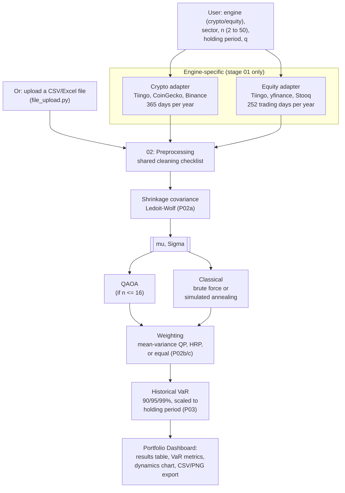
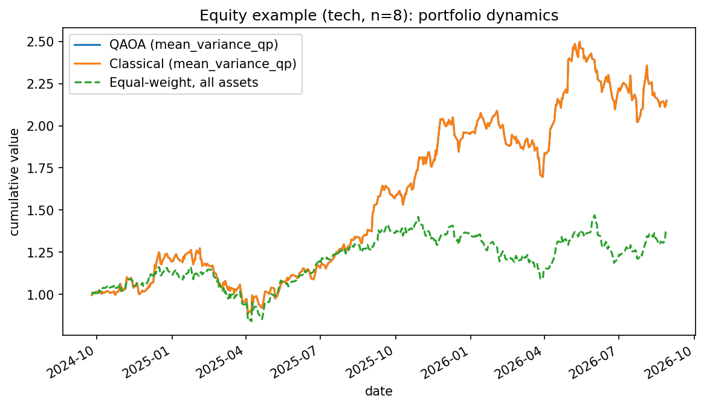
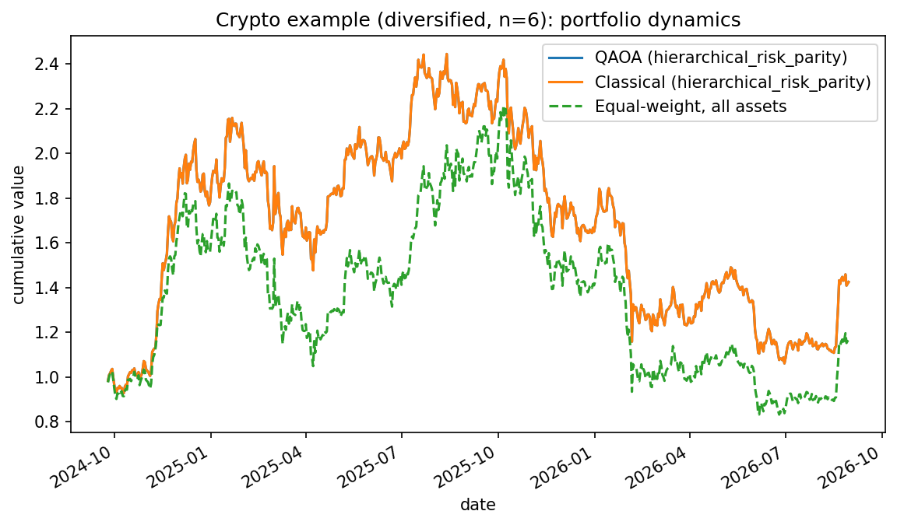

# QAOA for Constrained Portfolio Dashboard (Part 2)

The portfolio-management extension to the academic project in [README.md](README.md):
pick an asset universe (or upload your own), and both QAOA and a classical method build
a real, weighted portfolio from it - selection, continuous weights, and historical
Value-at-Risk, on real crypto and equity data, side by side.

This document is Part 2's own reference, kept deliberately separate from Part 1's README
per the project instructions ("academic part and portfolio part should be related but not
be together") - it lives on its own branch, reuses Part 1's engine as a library rather than
duplicating it, and writes its own results to `portfolio_results/`, never touching
`results/`.

---

## Contents

1. [Why this project](#1-why-this-project)
2. [About the data](#2-about-the-data)
3. [Instructions](#3-instructions)
4. [Architecture](#4-architecture)
5. [Models used](#5-models-used)
6. [Assumptions](#6-assumptions)
7. [Necessary results](#7-necessary-results)
8. [Plots](#8-plots)
9. [What is intentionally not built](#9-what-is-intentionally-not-built)
10. [Glossary](#10-glossary)
11. [References](#11-references)

---

## 1. Why this project

Part 1 answers a research question: does QAOA have any edge over classical methods at
selecting *which* assets to hold. The answer, argued at length in Part 1's README, is no -
not at any size this project can test. Part 2 asks a more practical question instead: given
that both QAOA and classical methods reach essentially the same answer at these sizes, what
does it take to turn "which k assets" into an actual, usable portfolio - with real weights,
a real risk figure, and a real interface a person could click through - built on top of the
exact same solver core, not a separate project?

Everything Part 1 built (the adapters, the QUBO, the QAOA solver, brute force, simulated
annealing) is reused here as a library. What's new is everything a selection alone doesn't
give you: sector/holding-period filters, continuous weights among the selected assets,
shrinkage covariance estimation, historical Value-at-Risk, a transaction-cost adjustment,
a generic file-upload path, and the dashboard page itself.

## 2. About the data

Same two engines as Part 1 (crypto, equity), same adapters, same `data_cache/`, same
Tiingo-first fallback chain - nothing about *how* prices are fetched changes for Part 2.
What's new sits entirely on top:

| | Crypto engine | Equity engine |
|---|---|---|
| Sector universes | `layer1`, `payments_stable_adjacent`, `defi_infra`, `meme`, `diversified` (informal groupings - crypto has no GICS-style sectors) | `energy`, `tech`, `healthcare`, `financials`, `consumer`, `industrials`, `diversified` (real GICS-style sectors, 20 tickers each) |
| Selection flow | engine -> optional sector -> n (2-50) -> holding period -> run | same |
| Custom data | Not applicable | Upload your own CSV/Excel via the "Upload your own file" data source |

**Sector universes** (`engine/01_data/equity_adapter.py` and `crypto_adapter.py`,
`SECTOR_UNIVERSES` dicts) are static, curated lists of real, liquid, well-known
symbols - a one-word switch instead of pasting a new ticker list every time, per the
instructions. They are not an attempt at an exhaustive or auto-updating index-membership
feed. If a request asks for more assets than a sector's list has, the adapter truncates and
the dashboard reports the **actual** count used against what was requested, rather than
silently running a smaller portfolio - found as a real bug during testing (see section 6).

**Holding period** is a *different* knob from Part 1's `return_freq`. `return_freq`
controls what interval returns are computed over for mu/Sigma (kept at daily here, for
statistical power); holding period ("Daily", "1 Month", "3 Months", "6 Months", "1 Year")
is how long the user intends to hold the portfolio, and is used to scale the historical
VaR window (`portfolio_engine/03_risk_metrics/value_at_risk.py`) to the right horizon.

**Custom file upload** (`portfolio_engine/01_universe/file_upload.py`): a user's CSV/Excel
export can be wide (one price column per symbol) or long/tidy (date, symbol, price columns);
the parser detects the shape and the relevant columns (date column by name or by
>90%-parses-as-a-date heuristic; a recognized price/symbol column pair for long format, or
every numeric column for wide format) and hands back the same `(prices)` contract Part 1's
own adapters produce - everything downstream is identical whether the data came from a live
fetch or an uploaded file.

## 3. Instructions

```bash
cd qaoa_academic_engine
git checkout portfolio-dashboard
pip install -r requirements.txt

# Run the dashboard (both pages - Academic and Portfolio Dashboard)
streamlit run dashboard/app.py

# Or run one example directly from the command line
python -c "
import sys; sys.path.insert(0, 'engine'); sys.path.insert(0, 'portfolio_engine')
import _bootstrap, _bootstrap_portfolio
from data_sources import UniverseSelection
from portfolio_pipeline import run_portfolio_pipeline
sel = UniverseSelection(engine='equity', sector='tech', n_assets=8, holding_period='3 Months', q=0.5)
result = run_portfolio_pipeline(sel, weight_method='mean_variance')
print(result.classical_portfolio.selection.selected_symbols, result.classical_portfolio.weights.weights)
"

# Regenerate the example runs/plots this README references
python scripts/run_portfolio_examples.py

# Run the Part 2 sanity-check suite (separate from Part 1's tests/sanity_checks.py)
python tests/portfolio_sanity_checks.py
```

On the dashboard's Portfolio Dashboard page: choose "Live fetch" or "Upload your own
file"; for a live fetch, pick an engine, an optional sector, how many stocks (2-50), a
holding period, a risk-aversion level, and a weighting method; optionally enable Ledoit-Wolf
shrinkage covariance and/or a transaction-cost adjustment; click **Run portfolio
construction**. Results appear side by side for QAOA and the classical method, each with a
filterable, sortable, CSV-downloadable table, portfolio-level VaR at three confidence
levels, and a downloadable PNG of the cumulative-growth chart.

No quantum hardware account or Tiingo key is required to reproduce anything in this
document - every result here ran on the free, keyless fallback sources, exactly as in
Part 1.

## 4. Architecture

### Repository layout (additions on top of Part 1's `engine/`)

```
qaoa_academic_engine/
  portfolio_engine/                 sister to engine/ - own numbered stages, own bootstrap
    _bootstrap_portfolio.py         named differently from engine/_bootstrap.py on purpose
                                     (see its own docstring - a same-named second import
                                     silently returns the first module instead of re-running)
    01_universe/
      data_sources.py               sector/holding-period selection, wraps engine stage 01
      file_upload.py                generic wide/long CSV-Excel extraction
    02_weighting/
      shrinkage_covariance.py       Ledoit-Wolf shrinkage (sklearn)
      mean_variance_weights.py      continuous QP weights among the SELECTED subset
      hierarchical_risk_parity.py   HRP, implemented from scratch (Lopez de Prado 2016)
    03_risk_metrics/
      value_at_risk.py              historical VaR at 90/95/99%, scaled to holding period
    04_constraints/
      transaction_cost.py           volatility-proxy transaction-cost adjustment to mu
    portfolio_pipeline.py           orchestrator - the Part 2 analogue of engine/pipeline.py
  dashboard/
    portfolio_page.py               the Portfolio Dashboard page (was a blank placeholder)
  scripts/
    run_portfolio_examples.py       generates this README's example runs and plots
  tests/
    portfolio_sanity_checks.py      Part 2's own checks, separate from Part 1's
  portfolio_results/                Part 2's own results (JSON + plots) - never results/
```

### Workflow diagram: both engines through the SAME downstream flow

The only place crypto and equity genuinely differ is stage 01 (the adapter: what gets
fetched, and the trading-day annualization factor, 365 vs 252). Everything from
preprocessing onward - cleaning, shrinkage, QAOA/classical selection, weighting, VaR - is
**one identical flow**, run twice with different inputs, not two separate pipelines:



## 5. Models used

- **Selection (unchanged from Part 1)**: QUBO via qiskit-finance, solved by QAOA (Aer
  simulator, standard mixer) and by an exact classical method chosen by size - brute force
  up to n=20, simulated annealing above that (`portfolio_pipeline.QAOA_MAX_N = 16` caps
  QAOA itself, per Part 1's own finding that it stops converging past that size).
- **Shrinkage covariance**: Ledoit-Wolf (`sklearn.covariance.LedoitWolf`) - pulls the raw
  sample covariance toward a scaled-identity target by a data-determined amount, addressing
  exactly the failure mode `gemini_search_techniques.txt` (this project's own research note
  for Part 2) names first: "small data errors cause MVO to produce extreme, unstable asset
  weights."
- **Continuous weighting, two methods, both applied to the SAME selected subset**:
  - *Mean-variance QP* (`cvxpy`): the standard long-only, fully-invested continuous
    Markowitz solve, restricted to the k selected assets.
  - *Hierarchical Risk Parity* (Lopez de Prado, 2016), implemented from scratch: tree
    clustering on a correlation-distance metric, quasi-diagonalization, then recursive
    bisection allocating weight inversely to each cluster's own variance - never inverting
    the full covariance matrix, the specific weakness HRP was designed to avoid.
- **Historical (empirical) VaR**, not parametric/Gaussian VaR - `gemini_search_techniques.txt`'s
  second named MVO weakness ("assumes returns follow a normal bell curve, which ignores
  severe market crashes"). Rolling-window quantiles of real realized returns, scaled to the
  chosen holding period, at 90/95/99% confidence.
- **Transaction-cost adjustment**: a linear haircut to mu proportional to each asset's own
  annualized volatility, used as an honestly-labeled proxy for illiquidity/trading cost in
  the absence of real bid-ask or volume data (see section 6, assumption 4).

## 6. Assumptions

1. **QAOA is capped at n=16 assets** (`QAOA_MAX_N`), not run-and-hope above that. This is
   not a UI convenience limit - it is a direct consequence of Part 1's own benchmarking
   (README section 9): standard QAOA stops converging at all past n=14-16 on a noiseless
   simulator, taking *minutes* to fail rather than seconds. Above the cap, simulated
   annealing stands in for the "quantum" column, stated explicitly in the UI, not hidden.
2. **A selection can come back infeasible, and this is shown, not silently absorbed.**
   Testing this dashboard at n=16 surfaced exactly this: QAOA selected 2 of a required
   k=8 assets on a real equity universe - reproducing Part 1's documented failure mode on
   real portfolio data for the first time. The dashboard now shows a explicit error banner
   (`_render_portfolio_block`, `dashboard/portfolio_page.py`) whenever `selected != k`,
   rather than quietly weighting whatever subset came back as if it were a normal result.
3. **Sector universes and the diversified default can be smaller than what's requested.**
   Found while testing n=20: the diversified equity list was capped at 15 tickers
   regardless of the slider, silently returning a 15-asset portfolio for a 20-asset
   request. Fixed by expanding the curated lists (20 per sector, 40 diversified) and by
   the dashboard explicitly comparing requested vs. actual asset count after every run
   (section 2). A request can still exceed a sector's real list size (crypto sectors are
   smaller than equity ones) - reported, not hidden, when it happens.
4. **Transaction cost uses annualized volatility as an illiquidity proxy, not a real fee
   schedule.** No bid-ask spread or trade-volume data is fetched; the cost coefficient is
   an adjustable, clearly-labeled dashboard control, not a market data point.
5. **Portfolio weights, not just selection** - unlike Part 1 (equal-weighted by design,
   README section 6), Part 2 solves an actual continuous weighting problem among the
   selected assets. This is intentionally a *separate, later* step from cardinality
   selection: QAOA/classical answer "which k," a standard convex QP or HRP answers "how
   much of each" - different tools for genuinely different kinds of problems, not two
   formulations of the same one.
6. **Historical VaR uses overlapping windows**, trading window independence for sample
   size - a standard, explicitly-stated trade-off (`value_at_risk.py`'s own docstring), not
   introducing autocorrelation that wasn't already in the real return series.
7. **No transaction costs are actually deducted from realized returns in the dynamics
   chart** - the transaction-cost adjustment (when enabled) only reduces the SELECTION
   objective's mu, it does not simulate paying to enter/exit the position in the
   cumulative-growth plot.
8. **FnO (futures & options) is out of scope for this build**, by explicit decision with
   the project owner: real futures/options data (strikes, expiries, Greeks, continuous-
   contract rollover) is not freely available for NSE and would be a fundamentally
   different, much larger build than the mu/Sigma-driven selection this project is built
   around. Crypto and equity only.

   **A further caveat specific to F&O, independent of the data-availability problem
   above**: even with data in hand, this project's mean-variance formulation as coded
   assumes each asset is a linear, buy-and-hold position - a fixed quantity held for the
   period, whose return is just the underlying's return. That is a reasonable
   approximation for **futures** (a leveraged but still linear exposure to the
   underlying). It is **not** a good model for **options**: an option's payoff is
   nonlinear in the underlying's price (and path-dependent near expiry via time decay),
   and it expires - so "the expected return and variance of holding this option for the
   period," the two numbers the entire solver core is built around, is not even a
   well-defined question the way it is for a stock or a future. Extending this project to
   options would need a different formulation entirely (Greeks-based risk measures like
   delta/vega/theta exposure, or modeling the option's payoff distribution directly,
   e.g. via Monte Carlo over the underlying) - not a parameter change to the existing
   QUBO. Flagged here explicitly rather than left implicit, since it is exactly the kind
   of honest scope-limiting note the rest of this project already holds itself to.

## 7. Necessary results

Two real runs (`scripts/run_portfolio_examples.py`, raw JSON in `portfolio_results/`),
neither cherry-picked - the first configuration tried for each engine:

### Equity: tech sector, n=8, 3-month holding period, mean-variance weights

Requested and actual universe matched exactly (8/8 tickers survived cleaning): AAPL,
AVGO, CRM, GOOGL, META, MSFT, NVDA, ORCL. Shrinkage intensity 0.062 (a modest pull toward
the target - eight large, liquid, well-covered names give Ledoit-Wolf a reasonably
well-conditioned sample covariance to start from).

| | QAOA | Classical (brute force) |
|---|---|---|
| Selected (k=4) | AAPL, AVGO, GOOGL, NVDA | AAPL, AVGO, GOOGL, NVDA |
| Feasible / converged | Yes / Yes | Yes / n/a (exact) |
| Weights (mean-variance QP) | 0%, 18.2%, 81.8%, 0% | identical |
| Expected return (annualized) | 39.9% | 39.9% |
| Time | 43.6s | 0.002s |
| VaR 90% / 95% / 99% (63d) | 13.4% / 20.1% / 27.7% | identical |

QAOA and classical reach the exact same selection and weights - consistent with every
Part 1 finding at this size: no daylight between the two on quality, ~20,000x slower on
time.

### Crypto: diversified sector, n=6 requested, 1-month holding period, HRP weights

Requested 6, **5 actually used** after cleaning (bitcoin, ethereum, binancecoin, solana,
ripple) - reported here exactly as the dashboard reports it, not smoothed over. Shrinkage
intensity 0.017 (crypto's own higher realized volatility gives Ledoit-Wolf less reason to
distrust the raw sample covariance here).

| | QAOA | Classical (brute force) |
|---|---|---|
| Selected (k=2) | bitcoin, ripple | bitcoin, ripple |
| Feasible / converged | Yes / Yes | Yes / n/a (exact) |
| Weights (HRP) | 77.1%, 22.9% | identical |
| Expected return (annualized) | 18.3% | 18.3% |
| Time | 22.0s | 0.0003s |
| VaR 90% / 95% / 99% (21d) | 12.9% / 19.3% / 29.5% | identical |

Same pattern as the equity example: identical answer, QAOA measured in tens of seconds,
classical in fractions of a millisecond - the same honest finding Part 1's README documents
at length, now confirmed on two more real, independent instances built through the full
Part 2 pipeline (weighting and VaR included, not just raw selection).

## 8. Plots

Portfolio dynamics (cumulative growth of $1), QAOA vs. classical vs. equal-weight-of-everything,
side by side:

<table><tr>
<td></td>
<td></td>
</tr></table>

QAOA and Classical lines overlap exactly in both charts (identical selection and weights,
per section 7) - the visible gap in each plot is the selected portfolio vs. the naive
equal-weight-of-every-available-asset baseline, not QAOA vs. classical.

## 9. What is intentionally not built

- **FnO (futures/options) engine** - see assumption 8 (data availability), and its
  attached caveat (options specifically would also need a non-linear-payoff
  formulation, not just data). Crypto and equity only.
- **Parametric (Gaussian) VaR as an alternative to historical VaR** - historical/empirical
  VaR was chosen as the primary, more defensible method (section 5); a parametric
  cross-check was considered but not added, to avoid two risk numbers on one dashboard
  without a clear reason to prefer one.
- **A fixed (non-convex) per-trade transaction cost model** - the implemented cost
  adjustment is linear/proportional (keeps the QUBO's structure unchanged); a genuinely
  non-convex, discrete per-trade cost - the model that would make transaction costs change
  the *hardness* of selection, not just its inputs - is flagged as a further extension.
- **Black-Litterman and CVaR-based portfolio construction**, both named in
  `gemini_search_techniques.txt` alongside HRP and shrinkage - not implemented here.
  Black-Litterman needs investor "views" as an input this dashboard has no natural source
  for; CVaR-based optimization is a real, buildable extension but was scoped out to keep
  the weighting-method surface to two genuinely different techniques (mean-variance, HRP)
  rather than four partially-overlapping ones.
- **Real-time or auto-updating sector/index membership** - `SECTOR_UNIVERSES` are static,
  curated lists (section 2, assumption 3), not a live index-constituent feed.

## 10. Glossary

**CSV/Excel upload** - the generic file-upload path (`file_upload.py`) that lets a user
supply their own price history instead of a live fetch; auto-detects wide or long/tidy
format.

**Feasible (selection)** - a selection satisfying `sum(x) = k` exactly; QAOA is not
guaranteed to return one, and the dashboard flags it explicitly when it doesn't (section 6,
assumption 2).

**Historical VaR** - Value-at-Risk computed as an empirical quantile of REALIZED historical
returns, not assumed from a distribution - see section 5.

**Holding period** - how long the user intends to hold the portfolio; scales the VaR
window, distinct from `return_freq` (which controls mu/Sigma estimation frequency).

**HRP (Hierarchical Risk Parity)** - a weighting method (Lopez de Prado, 2016) that never
inverts the full covariance matrix, using hierarchical clustering plus recursive bisection
instead - see section 5.

**Sector universe** - a static, curated list of real tickers for one sector/category
(`SECTOR_UNIVERSES` in `equity_adapter.py` / `crypto_adapter.py`), a one-word dropdown
switch instead of pasting a new ticker list each time.

**Shrinkage covariance** - the Ledoit-Wolf estimator, pulling the sample covariance matrix
toward a structured target to reduce small-sample estimation error - see section 5.

**Transaction-cost adjustment** - a volatility-proxy linear haircut applied to expected
returns before selection, an adjustable assumption, not fetched market data - see section 6,
assumption 4.

**VaR (Value at Risk)** - the loss level not expected to be exceeded with a given
probability (90%, 95%, or 99% here) over the chosen holding period.

## 11. References

Builds directly on Part 1's methodology and literature review (see [README.md section
11](README.md#11-references) for the full QAOA/portfolio citation list). New references
specific to Part 2's weighting and risk methodology:

1. Lopez de Prado, M. (2016). *Building Diversified Portfolios that Outperform
   Out-of-Sample.* The Journal of Portfolio Management, 42(4), 59-69. (Hierarchical Risk
   Parity - implemented from scratch in `hierarchical_risk_parity.py`.)
2. Ledoit, O., & Wolf, M. (2004). *A well-conditioned estimator for large-dimensional
   covariance matrices.* Journal of Multivariate Analysis, 88(2), 365-411. (Shrinkage
   covariance, via `sklearn.covariance.LedoitWolf`.)
3. Markowitz, H. (1952). *Portfolio Selection.* The Journal of Finance, 7(1), 77-91.
   (The original continuous mean-variance formulation `mean_variance_weights.py` solves.)
4. Gemini search summary (this project's own research note, `gemini_search_techniques.txt`,
   not independently re-verified against primary sources beyond items 1-2 above) - named
   Hierarchical Risk Parity, Black-Litterman, shrinkage estimators, and CVaR as the modern
   techniques motivating this section's scope; Black-Litterman and CVaR-based construction
   were scoped out (section 9), HRP and shrinkage were implemented.

### Data sources

Same as Part 1: Tiingo, CoinGecko, Binance public API, Yahoo Finance (via `yfinance`),
Stooq - see [README.md section 11](README.md#11-references) for full attribution.

### Software

Same as Part 1, plus: scikit-learn (`LedoitWolf`), SciPy (`scipy.cluster.hierarchy` for
HRP's tree clustering), matplotlib (downloadable chart export - see the note in
`dashboard/portfolio_page.py`'s `_dynamics_chart_png` docstring on why matplotlib was used
instead of Plotly's `kaleido` PNG export, which hung and spawned runaway processes in this
project's development environment).
